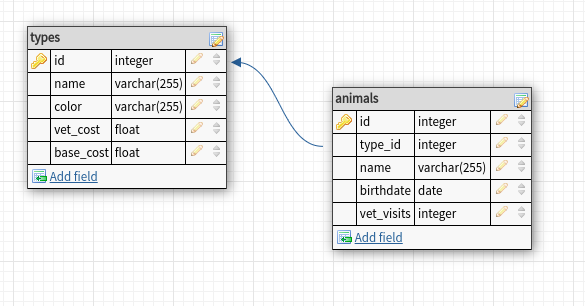

# Animal Shelter

## Setup steps
 - `composer install`
 - `create database and set .env file`
 - `php artisan migrate:fresh --seed`
 - `php artisan admin:install`
 - `php artisan admin:generate-menu`
 - Access admin panel on `/admin` using credentials: `admin/admin`

## Database
This project has a very simple database design:

## Details
 - There are types of animals that have name, color, vet and base costs.
 - There are animals that have name, age and vet visits count.
 - Each animal is related to one type.
 - Each animal's adoption cost depends on its age (cheaper when gets older) and vet expenses.
 - Admin should be able to view and edit the list of animal types.
 - Admin should be able to view and edit the list of animals.
 - Admin can change the age and vet visits count of an animal.
 - Client should be able to see and filter by types the list of animals.
 - Client should be able to see the details of any animal.

## Further development ideas
 - Admin forms validation
 - Animal adoption age limit
 - Adding breeds, custom vet prices per breed
 - Adding image of an animal

